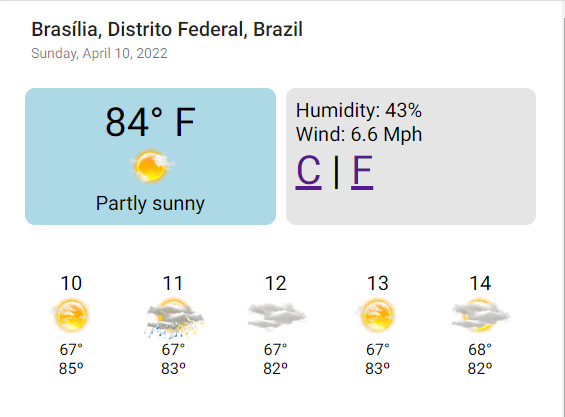

# Weather App for IDB

This project shows the current temperature for your location, if permission is given on the browser

It was built using Angular and .Net Core Minimal API.

It is published on Azure using a Github Action, Azure Container Registry and Azure App Service. See the Github Action tab on this page to see how it works.

The application is running [here](https://weatherappmarcus.azurewebsites.net/).

It uses [AccuWeather API](https://developer.accuweather.com/) to get all the information about temperature, wind, rain probability, as well as the forecast for the next 5 days.

The backend has basic style checking using a `.editorconfig` file.

To run this project, open the solution on Visual Studio 2022 and configure the `WEATHER_API_KEY` environment variable on the Debug UI.

To run on Docker, use the `build.cmd` script. After the build, open the `run.cmd` script, configure your API Key, then run the script.

